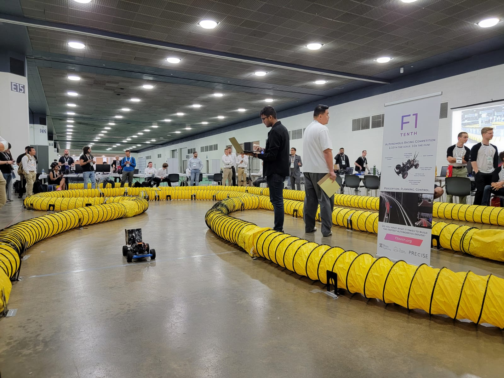

# IROS23 - Autoware Rocket



## This repository contains the files and scripts I wrote for the IROS 23 competition
It is very convenient and easy to use, once you get the hang of it and customize it according to your specific vehicle. I have tried to make it as modular as possible so that you can use it for your own vehicle. I have also added a lot of comments in the code to make it easier to understand. 

Another thing to note is that it would be smart to fork the repository and remove the `build`, `devel` folders and run `colcon build` before moving on to the next steps.

### The following are the steps to run the code
You need to make sure that you are on the same local/wifi network as your f1tenth vehicle. One simple way to do that is to get both your laptop and the vehicle on the same wifi network and then use ifconfig to get ip details. Once you have that, you can ssh into the vehicle using the following command -
```
ssh -L 9091:localhost:9091 -E /dev/null nvidia@192.168.90.231
```

or you can customize the script `car.sh` depending on your car's IP for the future.

Once you are in the vehicle, you need to run the following commands to get the vehicle up and running. Firstly, run `tmux` and get a new terminal. Then, run the following script in the terminal to automatically create 4 sourced windows - 
```
./run.sh
```

Next, you need to run the rosbridge server to get the rosbridge running. Run the following command in a new terminal -
```
ros2 launch rosbridge_server rosbridge_websocket_launch.xml port:=9091
```


### Generate Map using SLAM

Next, you need to run the slam toolbox to get the slam running. Run the following command in a new terminal -
```
ros2 launch slam_toolbox online_async_launch.py slam_params_file:=/home/nvidia/f1tenth_ws/src/f1tenth_system/f1tenth_stack/config/f1tenth_online_async.yaml
```

Next, you need to run the f1tenth stack to get the vehicle running. In this step, make sure your car has the controller connected either over bluetooth or usb dongle. Run the following command in a new terminal -
```
ros2 launch f1tenth_stack bringup_launch.py
```


Next, you need to run the foxglove to get the visualization running. Run the following command in a new terminal or just open foxglove and run connect to websocket on port 9091 -
`launch foxglove 9091`

Next, you need to run the map saver to get the map. Run the following command in a new terminal -
```
ros2 run nav2_map_server map_saver_cli -f "map"
```


### Run Particle Filter and Optimize trajectory

Now, you will have the map saved in your current directory. You need to move the map to the maps folder in the particle filter package. Run the following command in a new terminal -
```
sudo mv map* /home/nvidia/f1tenth_ws/src/particle_filter/maps/
```

Next, you need to build the particle filter from scratch again. This script enables you to remove all files and do a clean solo package build. Run the following command in a new terminal -
```
./rem_particle.sh
```


Next, you need to run the particle filter to get the localization running. Run the following command in a new terminal -
```
ros2 launch particle_filter localize_launch.py
```


Now, before doing that we need to generate an optimized trajectory for the vehicle to follow. To do that, we need to run the waypoint logger. Run the following command in a new terminal -
```
ros2 run pure_pursuit waypoint_logger.py
```

This script records the waypoints in a csv file. In the f1tenth_ws directory of your car. Make sure to run and get the center line of your track for this to work. Once you have the waypoints, you need to run the following command in a new terminal on your host laptop (assuming you have this script in the right directory)-
```
./f1.sh
```
You would need to specify the track width which would be the distance of the car to any one side of the track (Make note that we are assuming the car is in the center of track at all times). As a tip, I usually put in a value of 0.2m less that the original value to have the car run more safely in any given track.

### Run Pure Pursuit 

Now, you have the checkpoints. Next, you need to run the pure pursuit to get the vehicle running. Run the following command in a new terminal -
```
ros2 run pure_pursuit pure_pursuit_node
```

### Local planner and more race suggestions

The local planner that I have added to this is a conventional Gap follow approach which triggers when the waypoint of the pure pursuit algorithm has an obstacle in a range less than it's lookahead. There is another approach which I implemented which was based on Time to Collision which can also be used to transition between the two states. You can easily modify anything in the `/scan_callback` function.

There is another script which helps rebuild the pure pursuit packages without doing extra manual work. You can run the following command in a new terminal -
```
./rem_pure.sh
```

### Addtional comments

To use this package effectively, you would need to change the following - 
1. The ip address of your car in all the scripts
2. The directory locations for a lot of the system specific files
3. The parameters in Trajectory generator for your respective track condition and style
4. To setup Foxglove, I followed https://github.com/JChunX/foxglove-onboard
5. There is also the vesc motor file in the scripts folder. You can use that configuration for your VESC MKV


Happy racing! 

